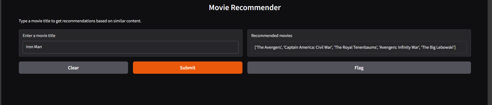
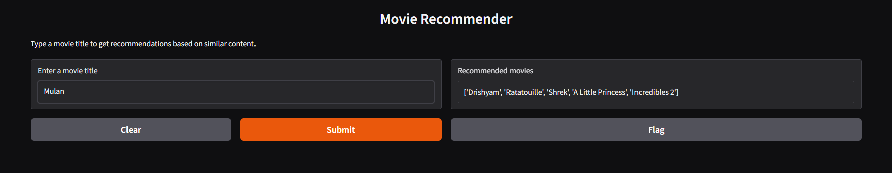

# Movie-Recommendation
This is _Content-Based_ ML Model with the _DATASET_: **imbd_top_1000.csv**. As per content based program you can only find the movies simmilar movies that are in Database Hence here is given the movies list.
This code here includes _user-input function_ directly and also using interface **Gradio**. Using **TfidfVectorizer** form _sklearn library_ and _feature_extraction_ subpackage.

---
Movies you can try checking: 
1. **Andaz Apna Apna**
2. **Baby Driver**
3. **Captain America: Civil War**
4. **Chak De! India**
5. **Die Hard**
6. **Enter the Dragon**
7. **Fight Club**
8. **Gravity**
9. **Harry Potter and the Goblet of Fire**
10. **Incredibles 2**
11. **Iron Man**
12. **Interstellar**
13. **Joker**
14. **Kai Po Che!**
15. **Kingsman: The Secret Service**
16. **Life of Pi**
17. **Mission: Impossible - Fallout**
18. **Mulan**
19. **Pirates of the Caribbean: The Curse of the Black Pearl**
20. **Pride & Prejudice**
21. **Queen**
22. **Raazi**
23. **Sherlock Holmes**
24. **Star Trek Into Darkness**
25. **The Avengers**
26. **The Exorcist**
27. **The Hangover**
28. **The Martian**
29. **The Matrix**
30. **The Notebook**
31. **The Wolf of Wall Street**
32. **Thor: Ragnarok**
33. **Titanic**
34. **To Be or Not to Be**
35. **To Have and Have Not**
36. **To Kill a Mockingbird**
37. **When Harry Met Sally…**
38. **Wreck-It Ralph**
39. **Zindagi Na Milegi Dobara**
40. **Zootopia**

---
#### Example of the Outputs:

---
In order to have any input and get Recommendation we can use APIs such as [API Refference](https://developer.themoviedb.org/v4/reference/intro/getting-started).

